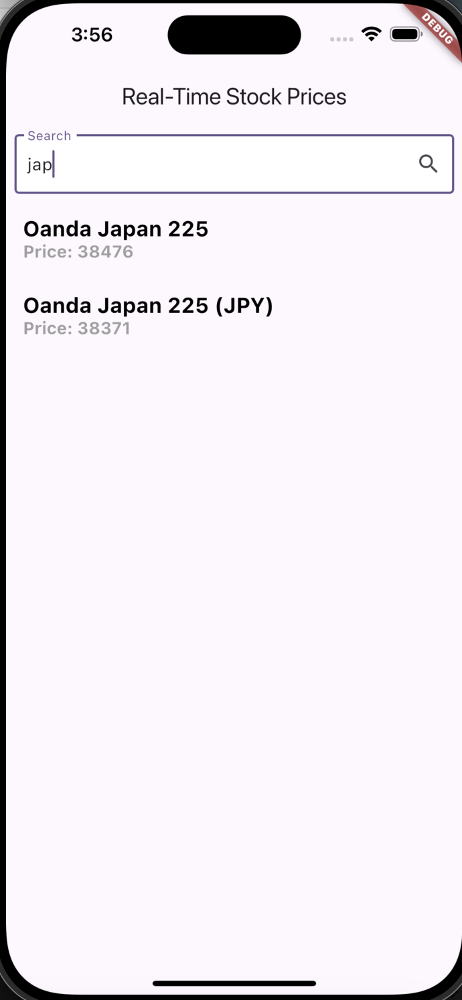

# trade_plus

## Overview
Trade Plus is a Flutter-based mobile application that displays stock symbols and their real-time prices. The application allows users to search for specific stocks and dynamically updates prices using WebSocket connections.

## Screenshot

## Prerequisites

Before you begin, ensure you have met the following requirements:
- Flutter SDK (Version 3.0 or higher)
- Dart SDK (Version 2.17 or higher)
- A valid API key from your stock data provider
- Git for version control

## Features and Design Decisions

1. **User  Interface Structure**:
   - The UI is structured using a `Scaffold` widget, which provides a basic layout with an `AppBar` and a body containing a `Column`.
   - The `Column` contains a `SearchInput` widget at the top for filtering stock symbols and an `Expanded` widget that houses the `StockList`, which displays the stock symbols and their prices.

2. **Dynamic Stock Price Updates**:
   - The application subscribes to real-time price updates via WebSocket. This allows for efficient updates without the need for constant polling, reducing bandwidth and improving performance.

3. **Limited Symbol Subscriptions**:
   - To ensure efficient performance, the application subscribes to a limited number of symbols at a time. This approach prevents overwhelming the WebSocket connection and optimizes resource usage.

4. **Pagination and on-demand resource loading**:
   - The stock symbols are loaded in a paginated manner, with a limit of 20 symbols per page. This approach improves performance and user experience by only loading a subset of data at a time.

5. **Filtering**:
   - A search input allows users to filter the list of stock symbols based on their descriptions. This enhances usability by enabling users to quickly find specific stocks.

## State Management Approach

- **Riverpod**:
  - The application utilizes the Riverpod library for state management. 
  - The state of stock prices is managed using a `Provider`, which allows for reactive updates to the UI when stock prices change.
  - The use of `Consumer` and `ConsumerWidget` enables widgets to listen to specific providers and rebuild when their state changes, ensuring that the UI is always in sync with the underlying data.

## Third-Party Libraries Utilized

1. **Flutter Riverpod**:
   - A state management library that provides an easy-to-use API for managing state in Flutter applications. It enhances performance and reduces boilerplate code compared to traditional state management solutions.

2. **WebSocket**:
   - A WebSocket service is implemented to handle real-time communication for stock price updates. This allows the application to subscribe to stock symbols and receive price updates in real time.

3. **http**:
   - The `http` package is used for making network requests to fetch stock symbols from a REST API.

## Installation and Running the project

1. Clone the repository:
git clone https://github.com/deepnrng007/trade_plus.git

2. Navigate to the project directory:
cd trade_plus

3. switch to branch `riverpod_impl`
git checkout riverpod_impl

3. Install dependencies:
flutter pub get

4. Create a .env file in the root directory and add your API key:
API_KEY=your_api_key_here

5. Run the app:
flutter run

6. To run the test: 
flutter test 
